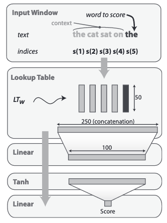
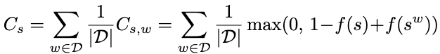

# Introduction

This program implements the language model from the paper **Curriculum Learning** [*Bengio, 2009*] using tensorflow.


# Prerequisite

You need python 3, and functional installation of tensorflow 2.

You also need `configargparse` module for management of configuration files.

```
pip install configargparse
```

# Usage

Data is expected to be space-pretokenized. Vocabulary can be either precalculated, in that case, it must be in a file where each line is a token, and the token list must absolutely be sorted by decreasing frequency (this order is important, since curriculum learning filters out sentence with rarest vocabs).
If not provided, vocabulary is dynamically calculated on training data and sorted (this is not efficient at all on a large training data).

The model architecture is hardcoded in the lines:

```python
main_input = K.layers.Input(shape=(5), dtype='int32', name='main_input')
embedding = K.layers.Embedding(VOC_SIZE+1, 50)(main_input)
o1 = K.layers.Reshape((250,))(embedding)
o2 = K.layers.Dense(100, activation='tanh')(o1)
predictions = K.layers.Dense(1)(o2)
```



The code is using tensorflow checkpoint saving and tensorboard metrics for following the progress.

You can use `-C config_file` to create a configuration file for some specific parameters, and use this configuration file with `-c config_file`.

Launching a training is simply done with: `python -c config_file` or `python [options]`.

See `python lm.py -h` for more information.

Function loss is **1-margin loss** function calculated as:



Given a 4-word context, this is technically implemented by replacing the fifth word by a random word, and taking as a loss the difference of the score with actual word and the score with the random word. During the training, each batch contains actual window followed by fake-window, and the loss is calculated by the special loss function:

```python
def loss_fnc(y_true, y_pred):
  positive = y_pred[0::2]
  negative = y_pred[1::2]
  loss = tf.maximum(0., 1. - positive + negative)
  loss = tf.reshape(tf.tile(tf.reshape(loss,[tf.size(loss),1]),[1,2]),[2*tf.size(loss)])
  return loss
```

*logrank* is calculated on `--test_size N` sentences of the test file - by finding the average logrank calculated on all the windows in the test examples. *logrank* for a given windows is the rank of the actual 4+1 example, in comparison with all the 4+other possible examples. Ideally the rank would be 1 meaning that given the 4 word context, the language model always rank the actual example first in comparison to all the other possible vocab in the same context. This prediction is however clearly not always possible, since 4 word context is small, and many other possible words can fit. When trained on 2009 English wikipedia corpus (638 million 5-word windows), the paper reports the best log rank being 2.68 meaning an equivalent rank of \~14.

Curriculum learning is activated with the parameters: `--curriculum_steps S` indicating how many steps are necessary to use full vocabulary. 1 step is the default, and means that the full vocabulary is used immediately (so without curriculum learning). The paper use 4 steps. A step is use for `--curriculum_examples N` examples - this parameter is calculated as in the paper, before the filtering of the sentences with out of vocabulary tokens.

# References

_BENGIO, Yoshua, LOURADOUR, Jérôme, COLLOBERT, Ronan_, et al. **Curriculum learning**. In : Proceedings of the 26th annual international conference on machine learning. 2009. p. 41-48.
