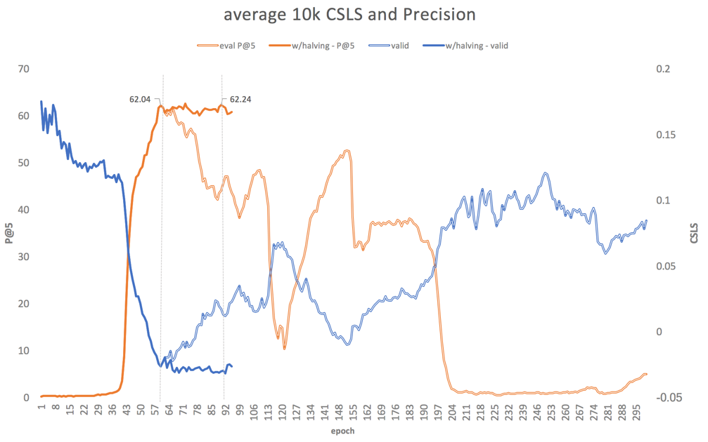
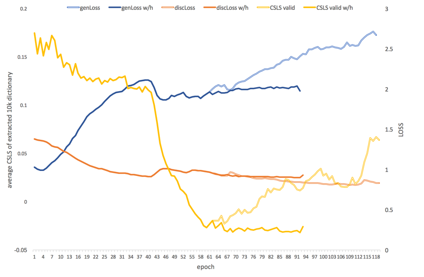

## Overview
[Conneau, A., Lample, G., Ranzato, M. A., Denoyer, L., & Jégou, H. (2017). *Word Translation Without Parallel Data*.](https://arxiv.org/pdf/1710.04087.pdf)

As a first step towards fully unsupervised machine translation, this paper demonstrates how to build a bilingual dictionary between two languages without using any parallel corpora, by aligning monolingual word embedding spaces in a fully unsupervised way.

This work is built on [Mikolov, 2013] showing that it is possible exploit the similarities of monolingual embedding spaces to build a mapping between monolingual embeddings. Using supervised approach, [Mikolov, 2013] successfully shows that a simple linear mapping *W* gives good result for this mapping. In addition, [Xing, 2015] show that such mapping can be improved by enforcing an orthogonality constraint on *W*.

Based on that starting point, the work described in the paper show that it is possible to learn and refine such a mapping with a fully unsupervized approach using adversarial learning. It is based on the following process (figure extracted from the paper):


- (A) As a starting point, we have two independently trained word embeddings (can be different domains or different languages). The goal is to train a mapping between these word embeddings. The mapping can be as simple as a linear mapping, but could be more complicated (any neural network).
- (B) A first version of this mapping is obtained using adversarial learning following [Goodfellow, 2014] - where the generator is the projection mapping, and the discriminator is trying to make a difference between source projected embedding and native target embedding
- (C) Based on this first mapping, a refinment method is proposed based on Procrustes solution [Schönemann, 1966]
- (D) With a new distance metric (CSLS) - dealing with *hubs* issue - source-target pairs are extracted

Key references:

* [Mikolov, T., Le, Q., & Sutskever, I. (2013) *Exploiting similarities among languages for machine translation*.](https://arxiv.org/abs/1309.4168)
* [Xing, C., Wang, D., Liu, C., & Lin, Y. (2015). *Normalized Word Embedding and Orthogonal Transform for Bilingual Word Translation*.](http://anthology.aclweb.org/N/N15/N15-1104.pdf)
* [Schönemann, P. H. (1966). *A generalized solution of the orthogonal Procrustes problem*](https://link.springer.com/article/10.1007/BF02289451)

Major follow-up:

* [Lample, G., Denoyer, L., & Ranzato, M. (2017) *Unsupervised Machine Translation Using Monolingual Corpora Only*.](https://arxiv.org/pdf/1711.00043.pdf)

## Step-by-Step analysis and Implementation notes

### The models
* The generator is a simple Linear mapping defined in `net.py`, `Generator` class. The class also implement `orthogonalityUpdate` method (section 3.3). This method is called after each gradient update. Any other model could be implemented - just think about adaptation of the `orthogonalityUpdate` method.
* The discriminator is a 2 layer network implemented also in `net.py` and as defined in 3.1. It has a single cell output activated by a sigmoid. The value is the probability of the input being a true target embedding.

```
Sequential (
  (0): Dropout (p = 0.1)
  (1): Linear (300 -> 2048)
  (2): LeakyReLU (0.01)
  (3): Linear (2048 -> 1)
  (4): Sigmoid ()
)
```
* Loss function is Binary Cross Entropy measure (`BCELoss`)

it would be possible to consider a two cell output - and use a softmax layer, but I think this approach is simpler.

### Extracting source-target pairs
* Fast nearest neighbors is implemented using Facebook FAISS library [Johnson 2017] - using python binding
* To calculate Cross-Domain Similarity Local Scaling (CSLS) - as defined in section 2.3 - the value \( r_S(y_t) \) is pre-calculated for the full target-dictionary. The results of FAISS `search` are rescored using the CSLS metrics
* !!note!! - I only implemented one-way CSLS. In 3.4, it is also mentioned that the mutual nearest neighbor are also considered to restrict the list of candidates.

### Evaluation
An internal EN-FR dictionary is provided and can be used for evaluation with the `--evalDict` option. Note: this is note the dictionary used by the authors but it gives same type of results.

The provided dictionary has multiple meanings for each simple word, so for the calculation of the precision, I just give credit if one hypothesis matches one of the available meanings.

Note that the dictionary does not contain inflected form, so the score is under-evaluated since the proposed meaning might be available but in lemmatized form. Also source words missing from the evaluation dictionary are not taken into account. This could be improved using inflected form dictionary and/or stemming but my goal was just to validate the approach.

For instance - the first entry below corresponding a correctly hypothetized tranlsation for the word `men`, is ignored since `men` is not part of the reference dictionary, and the second is considered as wrong because `peut` would normally count in P@5 but is the inflected form of `pouvoir` so not validated by the dictionary.

```
men hommes      eux     les     enfin   ,       alors   que     ainsi   même    pourtant
can éventuellement      eventuellement  faut    peut    sinon   exemple sachant ou      bien    effectivement
```

*It will be interesting to check the content of the authors dictionary for the evaluation*.

### Adversarial Training
For adversarial training, the process described in [Goodfellow, 2014] as been implemented:
* first, k-steps of discriminator update using *m=batchSize* projected source example, and *m=batchSize* native target. As suggested, I use label smoothing for calculating the loss of the native target.
* then, one mini-batch update of the generator is done propagating gradient from the discriminator with inverse loss function.

## Unsupervised Model Selection and decay/early stopping strategy
* average CSLS on first 10k is used as validation criterion (3.5)
* for each epoch, `-decayRate` is applied on learning rate
* if validation score is going up for 2 epochs with relative increase larger than twice `--halfDecayTreshold` parameter, the learning rate is divided by 2
* when learning rate reaches 1/20 of initial learning rate, the training stops

### Refinement
Refinement Procedure as described in 2.2 is not yet implemented

## Using the script

### Dependency

* `pytorch`
* `scipy`
* `progressbar2`
* `FAISS` (more tricky to install)

GPU can be used if available with `--gpuid ID` option in the script.

A luatorch version is also provided - it includes the adversarial training, and the (non optimized) nearest neighbors extraction.

### Running it
* Get fasttext word embeddings
```
wget https://s3-us-west-1.amazonaws.com/fasttext-vectors/wiki.en.vec ;
wget https://s3-us-west-1.amazonaws.com/fasttext-vectors/wiki.fr.vec
```

* Train a model:
```
python src/train.py wiki.en.vec  wiki.fr.vec --vocSize 50000 --gpuid 0 --nIter 40
```
note that the word embeddings will be saved to binary format so that next call can just load these binary files as following:
```
python src/train.py wiki.en.vec_50000.bin wiki.fr.vec_50000.bin --vocSize 50000  --gpuid 0 --nIter 40
```

Also - to speed-up calculation, the calculation of *rs(yt)* (formula 6) is done at the beginning of the script, and saved in file `wiki.fr.vec_200000.bin_rs_knn10` for further runs (depends only on vocabulary size and knn value).

Most of the parameters of the process can be set in commandline as follow:

```
WORD TRANSLATION WITHOUT PARALLEL DATA

positional arguments:
  srcemb                source word embedding
  tgtemb                target word embedding

optional arguments:
  -h, --help            show this help message and exit
  --seed SEED           initial random seed
  --vocSize VOCSIZE     vocabulary size
  --dim DIM             embedding size
  --hidden HIDDEN       discriminator hidden layer size [3.1]
  --discDropout DISCDROPOUT
                        discriminator dropout [3.1]
  --smoothing SMOOTHING
                        label smoothing value [3.1]
  --samplingRange SAMPLINGRANGE
                        sampling range on vocabulary for adversarial training
                        [3.2]
  --beta BETA           orthogonality adjustment parameter (equation 7)
  --k K                 #iteration of discriminator training for each
                        iteration
  --batchSize BATCHSIZE
                        batch size
  --learningRate LEARNINGRATE
                        learning rate
  --decayRate DECAYRATE
                        decay rate
  --nEpochs NEPOCHS     number of epochs
  --halfDecayThreshold HALFDECAYTHRESHOLD
                        if valid relative increase > this value for 2 epochs,
                        half the LR
  --knn KNN             number of neighbors to extract
  --distance {CSLS,NN}  distance to use NN or CSLS [2.3]
  --load LOAD           load parameters of generator
  --save SAVE           save parameters of generator
  --evalDict EVALDICT   dictionary for evaluation
  --gpuid GPUID

```

The 10k first entries of the dictionary with are dumped at the last epoch.

The option `--load file` and `--save file`, can be used to save and reload the generator state.

## Some results
* 10k first English-French entries are provided [here](./sample.md) - corresponding to a P@5 score of 62.24 (vs. P@1 77.8 in the paper without refinment but using the authors own dictionary). The hyper-parameters are the same than the ones in the paper (except batch size)
* Unsupervized model selection: as shown in Figure 2 of the paper, the highest precision (evaluated on reference dictionary) is also corresponding to minimal average CSLS score over the first 10k entries - here at the epoch 59. The empty lines are showing score and precision for a training without half-decay strategy.

* For the same run, the following graph shows the evolution of the generator loss, of the discriminator loss, and of the (unsupervized) validation score. It is interesting to see that the discrimator loss decreases continuously till epoch 43 then struggle to keep position while generator loss decreases. In this run, a continuous decay rate of 0.99 was used, both halving/no halving of the learning rate was done (respectively plain, empty lines). Also - learning rates of generator and discriminator are the same. It could be interesting to investigate other strategies.

* Finally, I tried for more challenging language pairs like Korean-English - the shape of the curves are really different. First, the generator does not seem to fool *at all* the discriminator. Also after few epoch of discriminator training, the loss of the generator training raises drastically as if discriminator wins the battle. In parallel, the validation curve does not show any clear sign of minimum reaching. I did not have any reference Korean-English dictionary to get an evaluation of the results, but surfing through generated dictionary does not show any good mapping. In the paper, scores for more exotic languages like Russian and Chinese are also comparatively very low. Is the mapping for these languages possible at all? More experiments with other hyper-parameters might help?


## Personal comments and Discussions
* Even without the refinment implementation, the results are as good as promised by the paper: without using any explicit bilingual knowledge, the proposed approach proves is possible to build a relatively accurate word translation table. We could argue that since the word embeddings have been trained on wikipedia (see [fasttext](https://github.com/facebookresearch/fastText), there is some implicit _aligned knowledge_ that is necessarily reflected in the embeddings - leading to these results. Still it is still a wonder that multilingual word embeddings can be aligned like this, and with such a simple transformation. It would be interesting to test with other embeddings built on different sources of data. The experiments from the authors showing that even on a same language, we cannot align so easily wikipedia-trained word embedding and gigaword-trained word embedding is also confirming this intuition. So probably, the usage of this method is optimal for comparable corpora.

There are some limits in the extraction:

* The mapping can not really deal with polysemy, since all meanings for a source word will necessarily be in the same "neighborhood". This is not a problem of the approach, but this is the very nature of these word embeddings forcing multiple meanings to share single representations. It could be interesting to see what would happen with adaptive skip-gram word vectors...
* Also, beyond polysemy and contextual mappings, what is also really missing is the notion multi-word expression which are critical for a human perspective and building of a translation lexicon.

Regarding the potential usage of this work, it is clearly not directly usable to build human-ready word translation table: for most language pairs, such resource is already available with higher quality and without all the limitations mentioned, on the other hand for rarer language pairs, the quality is far lower and would be challenged very quickly by any traditional (human) resource building process.

However, the findings and implications of this work are a huge step forward better understanding of cross-language word embeddings and knowledge representation, and this work is clearly the _apetizer_ for the the main course - also published by facebook research team - *Unsupervised Machine Translation Using Monolingual Corpora Only*...

Keep tuned...
